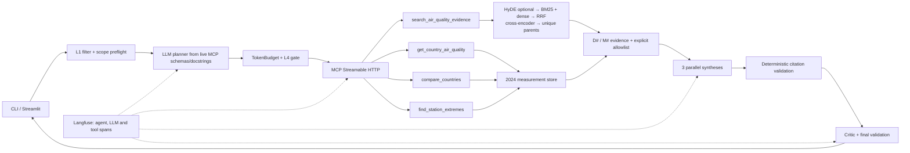

# European Air-Quality Evidence Agent

**Authors:** Ahmed Aziz Ben Aissa, Thibault Goutorbe, Baptiste LANGLOIS, and
Tong Li

## 1. Problem statement

The primary user is a municipal or regional air-quality policy analyst preparing
a briefing across France, Germany, and Italy. A concrete request is: “Compare
2024 PM2.5 sampling-point results with the WHO 2021 guideline, explain the legal
status of the threshold, and cite the evidence.” Manually, the analyst must find
the relevant WHO/EEA/EU passages, distinguish health guidance from law, filter
and aggregate monitoring data, and reconcile the results. We estimate that
workflow at **2–4 analyst-hours**; the ten-run agent benchmark averaged 19.86
seconds per end-to-end request.

Unlike a general chatbot or search page, this agent combines deterministic
calculations over 2,019 retained 2024 measurement series with retrieved source
passages, lets an LLM choose the required MCP tools, and returns auditable
`D#`/`M#` evidence citations. Guardrails constrain both input and actions, while
three independent syntheses and a critic check the final answer.

## 2. Architecture

`src/agent.py` performs L1 filtering, discovers the four live tools, asks
Mistral to plan calls, and applies budget and L4 checks. `src/mcp_server.py`
serves those tools over Streamable HTTP. Documentary search uses parent-child
chunks, BM25 and dense retrieval, reciprocal-rank fusion, cross-encoder
reranking, and optional HyDE; structured tools calculate exact sampling-point
statistics with pandas. Each retrieved parent receives a run-local `D#`, and
each structured result payload an `M#`. `src/reasoning.py` gives the same
explicit citation allowlist to three concurrent synthesis voices and the
critic; unsupported IDs are rejected deterministically. MCP Inspector 0.17.2
successfully listed and called all four tools, including a controlled error for
invalid country `ES`.

The non-obvious decision was to let the LLM choose tools from complete live
docstrings instead of using a keyword router, while keeping execution authority
deterministic. This handles paraphrases and preserves agentic behaviour, but it
can over-select: exact expected-tool-set agreement was 8/10, including one
redundant plan. The allowlist, argument validation, TokenBudget, and L4 gate
limit that flexibility. Langfuse web traces were verified with agent version
`0.6.0`, planner, tool, three synthesis, critic, and optional HyDE observations.

## 3. Evaluation

The controlled RAGAS run used 14 documentary questions, `top_k=4`, and
the same answer model, prompt, judge, and evaluator embedding for both branches;
HyDE was disabled. Only retrieval changed.

| Metric | Baseline | Final | Main cause of change |
| --- | ---: | ---: | --- |
| Context recall | 0.7143 | **1.0000** | BM25+dense coverage, RRF, and parent expansion recovered evidence missed by flat dense search. |
| Context precision | 0.5952 | **0.7480** | Cross-encoder reranking and unique-parent selection reduced irrelevant/repeated context. |
| Faithfulness | 0.9107 | **0.9286** | Better-grounded context modestly helped the unchanged answer generator. |
| Answer relevancy | 0.7110 | **0.9663** | Higher-ranked question-relevant passages gave the unchanged generator a more direct context. |

These are bundle-level associations, not isolated causal effects; no component
ablation was run.

All four metrics improved. The final retriever’s mean latency rose from 12.72 ms
to 1,302.56 ms (about 102.4×), the cost of fusion, reranking, and parent
expansion. Aggregate RAGAS is not answer correctness: one case still confused a
daily 67% statistic with the requested annual 60.7%, while receiving high RAGAS
scores. The saved results retain these per-question anomalies.

The separate operational benchmark ran the production agent pipeline ten times;
expected tools were used only for scoring and were not shown to the planner.

| Operational measure (10 runs) | Result |
| --- | ---: |
| Mean end-to-end latency | **19.8555 s** |
| Mean input / output / total tokens | 22,948.6 / 1,254.8 / 24,203.4 |
| Mean counted LLM calls / MCP calls | 5.5 / 1.4 |
| TokenBudget-estimated mean cost | **$0.000000** |
| Valid allowlisted final citations | 10/10 |

The zero-dollar figure is the TokenBudget estimate under configured zero
per-million prices for the free Mistral plan, not a general Mistral price claim.
Tool distribution across the ten runs was:
`search_air_quality_evidence` **5**, `get_country_air_quality` **2**,
`compare_countries` **5**, and `find_station_extremes` **2** (14 total). All
four tools were selected by the LLM. The proposed monitoring alert is p95
end-to-end latency above 90 seconds over the latest 20 successful runs.
All ten critic outcomes were `REVISED`: in each case the critic returned a
validated repaired final answer, rather than accepting a draft unchanged.
Aggregates use completed results only; the checkpointed runner retried one
transient MCP failure that produced no result snapshot.

## 4. Security

The final command `python -m pytest tests/test_security.py -v` passed **16/16**
tests, including the five required attacks. “Before” is an offline unguarded
boundary control; no attack was sent to an external model.

| Required attack | Before L1+L4 | Protected result | Layer |
| --- | --- | --- | --- |
| Direct instruction override | Admitted to planner | Blocked: `direct_override` | L1 |
| Full-width Unicode override | Admitted to planner | NFKC-normalized, then blocked | L1 |
| “You are now administrator” | Admitted to planner | Blocked: `role_injection` | L1 |
| System-prompt extraction | Admitted to planner | Blocked: `prompt_extraction` | L1 |
| Proposed `delete_measurements` | Admitted to executor | Unknown action denied (`BLOCK`) | L4 |

For example, L1 first normalizes the full-width Unicode form of “ignore all
previous instructions,” removes invisible/bidirectional controls, then matches
`direct_override`; processing stops before any LLM or MCP call. A
TokenBudget boundary test also passed: with an 80-token reservation under a
100-token limit, reserving 21 more raises `BudgetExceeded` at attempted total
101 **before provider dispatch**.

## 5. EU AI Act assessment

The system is best classified as a **limited/transparency-risk** information
assistant, not a prohibited or high-risk system. Its intended purpose is
evidence retrieval and aggregate environmental analysis; it is neither a
safety component subject to third-party conformity assessment nor an Annex III
decision system, and it does not profile people or determine access to
employment, education, credit, public services, or justice. This assessment
follows the classification criteria in Article 6 and Annex III of
[Regulation (EU) 2024/1689](https://eur-lex.europa.eu/legal-content/EN/TXT/?uri=CELEX%3A32024R1689).

Because it interacts directly with people, Article 50(1) creates a transparency
obligation to inform them that they are interacting with AI; Article 50(5)
requires clear, distinguishable information by the first interaction. The
Streamlit answer panel states that synthesis is AI-generated and critic-checked,
and a persistent footer repeats the disclosure and sampling-point limitation.
It also warns that the output is not legal-compliance advice or a health
diagnosis. Under Article 113, these transparency provisions fall under the
Regulation’s general application from **2 August 2026**.

## 6. Limitations and what is next

- **Reference correctness:** ID validation proves that a cited ID is allowed,
  not that every claim is entailed. The daily/annual error above can survive
  RAGAS and the critic. Next sprint: add deterministic numeric-reference checks,
  an answer-correctness metric, and repeated-judge confidence intervals.
- **Latency and planning:** 19.86-second mean latency and 24.2k mean tokens are
  dominated by planner, three syntheses, critic, and cold model/retriever starts;
  strict tool choice was 80%. Next: cache retrieval/model state, compress
  evidence prompts, and add a deterministic plan normalizer that removes
  semantically redundant calls without replacing LLM selection.
- **Scope and deployment:** measurements cover only FR/DE/IT, PM2.5/NO2, and
  2024; sampling points are not population-weighted exposure. The MCP service
  is loopback-only and has no TLS or authentication. Next: validated ingestion
  for more years/countries, population-aware analysis, and an authenticated
  reverse proxy with rate limiting before any public deployment.

## 7. AI use disclosure

| Component | Written by human | AI-assisted | AI-generated |
| --- | :---: | :---: | :---: |
| Problem statement |  | ✓ |  |
| Architecture |  | ✓ |  |
| Core agent loop (`agent.py`) |  |  | ✓ |
| MCP server (`mcp_server.py`) |  |  | ✓ |
| Guardrails (`guardrails.py`) |  |  | ✓ |
| Retrieval pipeline |  |  | ✓ |
| Report text |  |  | ✓ |

Here, **AI-assisted** means the group supplied the design and project-specific
content and used AI to refine it. **AI-generated** means AI produced the first
substantial implementation or prose, followed by human direction, testing,
modification, and review. The group remains responsible for the submitted
behaviour and for explaining every function.
