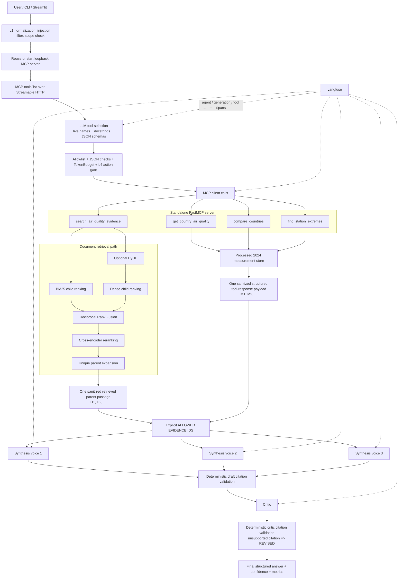

# Architecture

## System boundary

The project has CLI and Streamlit entry points plus a standalone MCP tool
service. Neither interface imports or calls tool implementations directly.
They connect to `src/mcp_server.py` over MCP Streamable HTTP, discover the live
tool definitions, let the configured LLM select from those definitions, and
execute only calls that pass deterministic security controls. For a missing
loopback endpoint, the shared runner can manage the server subprocess without
collapsing the HTTP boundary.

The live OpenAQ prototype under `new_tool/openaq_air_quality_tool/` is an
isolated experiment with its own server and tests. It is not registered with
the production agent, is not a fifth graded tool, and is outside the evaluation
boundary described below.



The three synthesis voices execute concurrently. The critic starts only after
all three are complete. MCP calls are currently executed in a bounded,
deterministic sequence after the model returns its plan.

## Request lifecycle

1. `src/agent.py` loads `.env` and performs local input preflight before opening
   a Streamable HTTP connection.
2. L1 applies Unicode NFKC normalization, removes invisible direction controls,
   rejects known prompt-injection patterns, and bounds input length. A narrow
   deterministic scope check rejects clearly unrelated questions and
   unavailable structured-measurement years before an LLM, MCP session, or tool
   call. This ordering avoids cancelling an initializing HTTP session for a
   locally rejected request.

   The year preflight now requires measurement intent and a supported-country
   scope before treating a year as a structured-data request. Documentary
   publication, methodology, guideline, directive, and target years such as
   2008, 2021, 2025, 2026, and 2030 therefore remain eligible for documentary
   retrieval. Explicit FR/DE/IT measurement requests for years other than 2024
   are still rejected locally, and L4 independently enforces `year=2024` on
   every structured tool call. The direct retrieval/RAGAS evaluator deliberately
   bypasses end-to-end preflight because it evaluates the retriever, not routing.
3. For an accepted question, the runner probes only a loopback HTTP `/mcp`
   target. It reuses a listening service or starts `src/mcp_server.py`, waits
   for TCP readiness, and later stops only the subprocess it owns. Remote and
   HTTPS endpoints remain externally managed.
4. The agent creates one run-scoped TokenBudget, opens Streamable HTTP, and
   calls `tools/list`. Only discovered tools that also appear in the
   L4 `ACTION_RISK_MATRIX` are exposed to the model.
5. Each allowed MCP definition is converted to an OpenAI-compatible function
   specification without replacing its live name, description, or input schema.
   The description originates from the Python function docstring.
6. The model receives the user question and the live tool specifications with
   `tool_choice="any"` and multi-call selection enabled. It must select one or
   more evidence tools. This is an LLM decision, not a keyword router.
7. The agent parses the returned JSON arguments, rejects unknown tools, removes
   exact duplicate calls, applies the CLI HyDE policy to documentary search,
   reserves budget, and runs L4 validation for every call.
8. The standalone MCP server returns a controlled JSON envelope. Tool failures
   are represented as structured error payloads instead of uncaught exceptions.
9. MCP execution records remain separate from citable evidence. Each parent
   passage returned by `search_air_quality_evidence` is sanitized and assigned
   its own sequential `D#`; different `D#` items may still originate from the
   same source document. Each successful structured-measurement tool call
   contributes one sanitized response payload and receives one sequential
   `M#`; one `M#` may contain several country, station, or aggregate values.
10. The agent constructs a run-scoped `ALLOWED EVIDENCE IDS` list containing
    only the `D#`/`M#` items produced for the current request. The identical
    list is passed to all three synthesis calls and the critic; MCP tool names
    and call sequence numbers are never valid evidence IDs.
11. Deterministic post-generation validation extracts bracketed citation-like
    IDs and rejects any draft containing an ID outside that exact list. This
    prevents invented citation IDs, but does not itself prove claim-to-source
    entailment or detect every uncited unsupported claim. Rejected drafts
    cannot be selected as fallback answers.
12. The critic receives the same run-scoped allowlist, evidence, candidate
    drafts, and deterministic draft-validation status. Its complete response
    is validated again. Any unsupported citation forces `REVISED`, never
    `PASS`; an invalid final answer is replaced by an accepted draft or a safe
    rejection.
13. The CLI or frontend displays the answer, critic decision, evidence IDs, HyDE status,
    the explicit three-synthesis call count, latency, model/tool counts,
    and budget usage. JSON mode retains the complete drafts and run record.

## LLM-selected tools and docstrings

MCP tool descriptions are operational inputs, not decorative comments. Each
docstring contains:

- **Use when:** positive selection criteria;
- **Do NOT use:** boundaries and the alternative tool;
- **Returns:** the evidence shape and important limitations;
- **Prefer:** choice guidance when tools overlap;
- **Example:** representative valid arguments.

That text, together with each JSON input schema, is what lets the LLM choose
between documentary retrieval and exact structured calculations. The current
four tools are:

| Tool | Backing component | L4 risk |
| --- | --- | --- |
| `search_air_quality_evidence` | Hybrid document retriever; optional HyDE can call an external LLM | MONITOR |
| `get_country_air_quality` | One-country aggregation in `MeasurementStore` | SAFE |
| `compare_countries` | Cross-country aggregation/ranking in `MeasurementStore` | SAFE |
| `find_station_extremes` | Sampling-point extreme values in `MeasurementStore` | SAFE |

### Why use LLM selection plus deterministic enforcement?

The earlier deterministic router was predictable but depended on English
keywords and could miss legitimate paraphrases. LLM selection uses the MCP
contract itself, which is more flexible and demonstrates agentic tool use. It
also introduces malformed arguments and over-selection as failure modes. The
design therefore separates **selection** from **authority**: the LLM proposes;
the allowlist, TokenBudget, and L4 gate decide whether execution is permitted.

## Retrieval pipeline

`search_air_quality_evidence` lazy-loads `AdvancedRetriever` once in the MCP
server process. The retrieval stages are:

1. Optionally create an 80-120 word hypothetical evidence passage (HyDE).
2. Rank 200-word child chunks independently with BM25 and normalized dense
   similarity. Dense retrieval blends the real query vector with the HyDE
   vector so generated text cannot replace the user's intent completely.
3. Fuse the sparse and dense rankings with reciprocal rank fusion (`k=60`).
4. Expand the candidate prefix when necessary to contain enough distinct
   parents.
5. Apply `cross-encoder/ms-marco-MiniLM-L6-v2` before context assembly.
6. Deduplicate by parent and return the 800-word parent passage associated with
   each best-scoring child.

HyDE runs only on this documentary path; measurement-only tools never invoke
it. It has a shorter timeout than the enclosing MCP request and falls back to
the original query on failure. The MCP response exposes generated/fallback/
disabled status, model, length, timing, and token usage, but never exposes the
hypothetical passage as evidence.

Budget-accounting boundary: HyDE executes inside the MCP server before the
agent receives the tool response. Its provider-reported usage is traced and
recorded in the run TokenBudget after completion. Agent-side planner, synthesis,
and critic calls are reserved before dispatch, but the agent cannot prevent an
already-issued HyDE call from crossing the remaining LLM call/token ceiling; an
over-limit usage report stops the run before reasoning continues.

The default first-stage pool is 30 children, the rerank pool starts at 20, and
the final context contains four unique parents. The pools expand adaptively
when repeated children would otherwise produce fewer than the requested number
of unique parents.

`sentence-transformers/multi-qa-MiniLM-L6-cos-v1` supplies dense embeddings.
The committed dense index is accepted only when its model, child count, and
child-file SHA-256 metadata match the live corpus.

## Structured measurement path

The three measurement tools use `MeasurementStore`, which validates the
processed dataset at load time and calculates results deterministically with
pandas. It supports:

- countries FR, DE, and IT;
- pollutants PM2.5 and NO2;
- year 2024;
- WHO 2021, EU 2030, and current EU annual benchmarks.

The server lazy-loads the store once per process. Every response includes
provenance and interpretation limits. Country rankings are based on retained
sampling points and are deliberately not described as population exposure.

## Guardrails and TokenBudget

The controls are independent of the model:

- **L1:** normalizes Unicode, removes invisible/bidirectional controls, detects
  direct overrides, role injection, privileged tags, and prompt extraction.
- **Tool-result sanitization:** strips active markup, marks suspicious text as
  untrusted external evidence, and bounds context length.
- **L4:** blocks unknown tools by default and validates every supported
  argument, including country, pollutant, year, benchmark, result limit, and
  search size.
- **TokenBudget:** reserves agent-side LLM calls and MCP calls before dispatch
  and caps per-run calls, input tokens, output tokens, and optional estimated
  USD. Thread-safe reservations prevent the three concurrent synthesis calls
  from oversubscribing shared limits. HyDE is the documented post-completion
  accounting exception because it runs inside the MCP process.

Token prices default to zero for the free Mistral tier. That keeps calls and
tokens bounded while reporting billed cost as zero. Setting
`AGENT_MAX_ESTIMATED_USD=0` disables only the monetary ceiling.

## Reasoning contract

The synthesis prompt contains a worked example and requires these ordered
sections:

```text
EVIDENCE
ANALYSIS
CONCLUSION
CONFIDENCE
```

The three voices use temperatures 0.15, 0.35, and 0.55. Parallel execution
reduces wall-clock latency while preserving self-consistency `k=3`. The critic
runs at temperature 0, checks citation grounding and distinctions such as
health guidance versus binding law, and returns `PASS` or `REVISED` with an
agreement score and final answer.

Documentary parent-passage results use `[D#]`; each structured tool-response
payload uses `[M#]`. Several `D#` items may originate from one source document,
and one `M#` item may contain multiple returned rows or aggregates. MCP calls
have separate execution records and are never cited. The exact run-scoped
allowlist is repeated verbatim in every synthesis prompt and in the critic
prompt. Deterministic validation blocks bracketed citation IDs outside that
list; semantic entailment remains the critic's model-based evaluation
responsibility.

The format does not require the same prose three times. `EVIDENCE` contains the
minimum source facts, `ANALYSIS` performs the comparison or interpretation, and
`CONCLUSION` gives the direct answer without copying those sections.

## Evaluation boundary

`tests/evaluate_retrieval.py` is the single baseline-versus-final evaluation
entry point. The baseline uses dense cosine search over flat 500-word chunks;
the final branch uses the production hybrid/RRF/reranked parent-child retriever.
Both branches receive the same golden question, answer-generation model and
prompt, RAGAS judge, and evaluator embedding model, so retrieval is the changed
variable. A full run reports context recall, context precision, faithfulness,
and answer relevancy. The offline `--retrieval-only` mode records comparable
document metrics, final parent metrics, and retrieval latency without claiming
that RAGAS ran.

The completed 2026-07-23 run evaluated 14 questions with `top_k=4` and HyDE
disabled in both branches:

| Metric | Baseline | Final |
| --- | ---: | ---: |
| Context recall | 0.7143 | 1.0000 |
| Context precision | 0.5952 | 0.7480 |
| Faithfulness | 0.9107 | 0.9286 |
| Answer relevancy | 0.7110 | 0.9663 |

Mean retrieval latency rose from 12.72 ms to 1302.56 ms. The archived audit
also records three important answer-level limitations: one exact-parent miss
(`gold_05`), one rounded/reference mismatch (`gold_10`), and one adjacent
daily-versus-annual statistic error (`gold_11`). The required RAGAS metrics do
not directly measure reference-answer correctness, so these cases remain
visible rather than being hidden by the aggregate gains.

This documentary golden set is intentionally separate from security rejection
tests and the completed ten-run operational benchmark. Invalid prompts should
be blocked, not scored as ordinary RAG answers; tool distribution, budget
triggers, cost, and end-to-end latency require agent-level runs rather than
retrieval contexts alone.

The operational run used agent version `0.6.0` and the real
LLM-selected-tool path for all ten questions. It completed 10/10 cases with
19.8555 s mean end-to-end latency, 24,203.4 mean total tokens, 5.5 mean counted
LLM calls, 1.4 mean MCP calls, and a TokenBudget-estimated mean cost of
`$0.000000` under zero-price free-plan settings. Strict expected-tool-set match
was 8/10; all four tools were selected at least twice, and every final answer
contained present, allowlisted evidence citations. Version `0.6.0` tightened
the synthesis contract after manual review: requested distribution/coverage
fields are required, and future legal thresholds must be described as
benchmarks until their application date rather than as current compliance
limits.

Security verification passed 16/16 tests. The four required input-injection
cases stop at L1, the unauthorized action stops at L4, and the deliberate
TokenBudget test proves an attempted 101 tokens against a 100-token ceiling is
rejected before dispatch. MCP Inspector CLI `0.17.2` independently listed
exactly the four production tools over Streamable HTTP, exposed their complete
schemas/descriptions, called each successfully, and received a controlled
`invalid_arguments` response for `ES`. npm warned that Node `20.19.2` is below
the Inspector release's declared `>=22.7.5` engine, although all commands
exited successfully; Node is not a Python runtime dependency.

## Observability

`src/observability.py` wraps Langfuse so tracing failures never become answer
failures. When configured, the trace contains:

- one top-level `air-quality-agent.run` agent observation with agent version;
- one `tool_selection` generation;
- one span per MCP call;
- an optional HyDE generation reported by the MCP retrieval response;
- three overlapping synthesis-generation spans;
- one critic-generation span;
- token usage and latency metadata where the provider reports it.

Authentication and live delivery have been verified in the Langfuse web
dashboard for an end-to-end run. The observed hierarchy includes the top-level
agent observation, tool selection, executed MCP tools, three synthesis
generations, the critic, and HyDE when enabled. The exact span count varies with
the model-selected tool plan and whether HyDE runs.

The proposed monitoring alert is p95 top-level `total_latency_ms` above 90,000
ms across the latest 20 successful runs. Sustained breaches direct investigation
to provider latency, retrieval-model cold starts, and MCP tool durations. This
is a documented alert policy, not a claim that dashboard automation is already
configured.

The short-lived CLI explicitly flushes observations before exit. If Langfuse
is disabled, uninstalled, or misconfigured, the same code path uses no-op
observations and the agent continues.

## Process and trust boundaries

- The MCP server remains a separate process. It can be short-lived and managed
  by one run, kept alive for repeated local requests, or deployed independently.
- The server is stateless at the HTTP protocol level, but caches read-only
  models and datasets inside its process.
- User input, model-proposed tool calls, retrieved documents, and tool payloads
  are all treated as untrusted at their respective boundaries.
- `.env` is local-only. `.env.example` contains no credentials.
- The current local service has no authentication or TLS; it binds to loopback
  by default and should not be exposed publicly without an authenticated
  reverse proxy and rate limiting.
